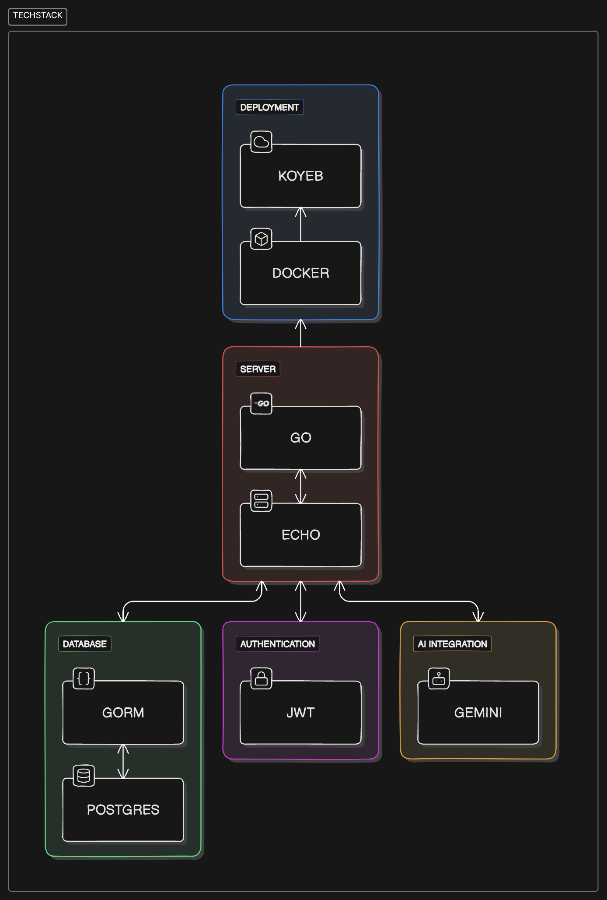
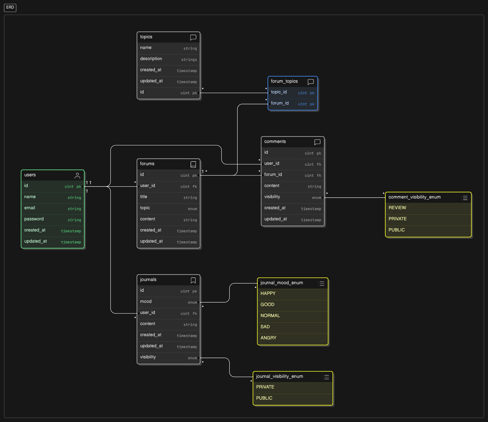

# Zense API
**Zense** is a mental health support platform designed to provide a safe and private environment for users to express their thoughts and feelings. Users can confide in an AI chatbot, participate in forums, and engage with a supportive community. The platform emphasizes privacy, empathy, and accessibility for anyone seeking mental health support.

## Table Of Contents
1. [Project Goals](https://github.com/shironxn/zense?tab=readme-ov-file#project-goals) 
2. [How It Works](https://github.com/shironxn/zense?tab=readme-ov-file#how-it-works)
3. [Tech Stack](https://github.com/shironxn/zense?tab=readme-ov-file#tech-stack) 
4. [Database Structure (ERD)](https://github.com/shironxn/zense?tab=readme-ov-file#database-structure-erd)
5. [Getting Started](https://github.com/shironxn/zense?tab=readme-ov-file#getting-started)
6. [Api Documentation](https://github.com/shironxn/zense?tab=readme-ov-file#api-documentation) 
7. [License](https://github.com/shironxn/zense?tab=readme-ov-file#license)
## Project Goals
### 1. **Support Mental Health**
 Zense aims to create a platform where users can confide in an AI chatbot and engage in meaningful, empathetic conversations that foster mental well-being.

### 2. **Data Privacy**
 Privacy is paramount in Zense. The AI confiding feature ensures that no conversation history is stored, providing users with a safe and private experience.

### 3. **Ease of Use**
 Zense is designed to be simple and intuitive, making it easy for users to interact with the AI, browse forums, and access the tools they need for mental health support.

## How It Works
- **AI Chat**: Users can chat with an AI that provides short, empathetic responses. No chat history is saved, ensuring complete privacy.
- **Forum**: Users can post questions, experiences, or support others in the community through the forum system.
- **Journal**: Zense includes a journaling feature to help users record their thoughts and feelings, allowing them to monitor their mental health more reflectively over time. 
## Tech Stack


Zense is built with the following technologies:

### Backend:
- **Go**: The core programming language for the backend.
- **Echo**: A high-performance web framework for Go, used to handle routing and middleware.
- **PostgreSQL**: The relational database used to store user data, forum posts, and other platform data.
- **GORM**: The ORM (Object-Relational Mapping) library used to interact with the PostgreSQL database.
- **JWT (JSON Web Tokens)**: For secure user authentication and authorization.
### Frontend:
- **Next.js**: A React framework for building the frontend of the platform (planned).
### AI Integration:
- **Google Gemini AI**: For handling AI-driven responses in user conversations.
### DevOps:
- **Docker**: Containerization of the application to ensure consistent deployment across different environments.
- **Koyeb**: Cloud hosting platform used for deploying the API and handling server infrastructure.
## Database Structure (ERD)


Zense's database structure is built with scalability and efficiency in mind, using PostgreSQL as the primary database. Below is the Entity-Relationship Diagram (ERD) outlining the main entities and relationships in the system:

- **Users**: Store user data, authentication details, and roles.
- **Forums**: Allow users to create posts and interact with the community.
- **Comments**: Users can leave comments on forum posts.
- **Vent**: Handles AI chat sessions.
## Getting Started
### Prerequisites
- **Go** (version 1.23 or later)
- **PostgreSQL** (version 12 or later)
- **Docker** (for containerization)
- **Git** (for version control)
### Installation
- Clone the repository
```
git clone https://github.com/shironxn/zense
cd zense
```
- Setup environment variables
```
cp .env.example .env
```
- Check available make commands
```bash
make help 
```
### Running Application
- With Docker
```
make docker-up
```
- Without Docker
```
make run 
```
## API Documentation
The API documentation is available via Swagger at: `/api/v1/docs` 

### Configuring the Documentation:
Before using api docs, you must update the Swagger configuration in `/cmd/main.go` to reflect your deployment environment. Specifically, modify the `schemes` and `host` to match the deployment.

**Example:**

In `/cmd/main.go`:

```go
// @host localhost:8080
// @schemes http
```
## License
[MIT](https://choosealicense.com/licenses/mit/) 

